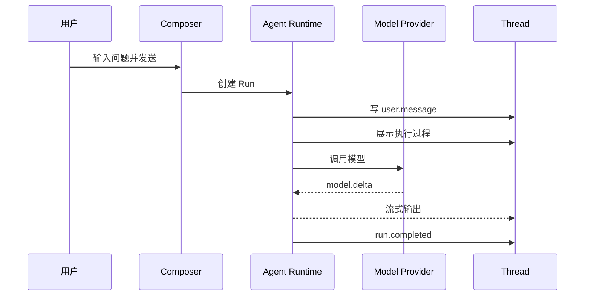
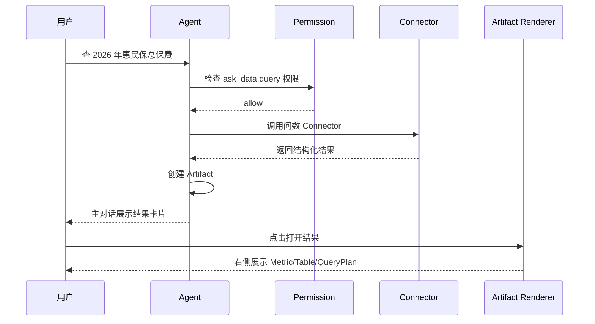
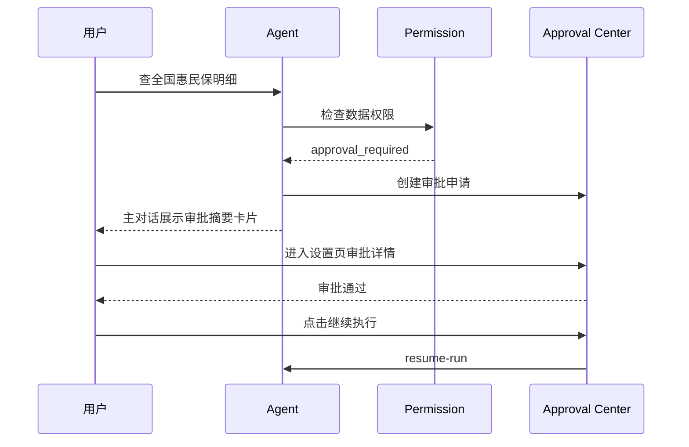
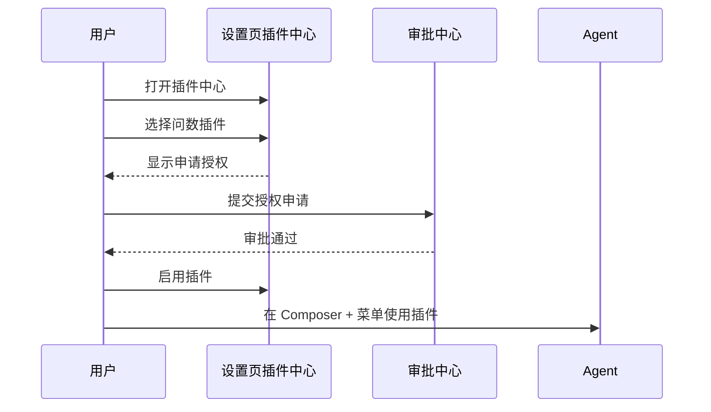
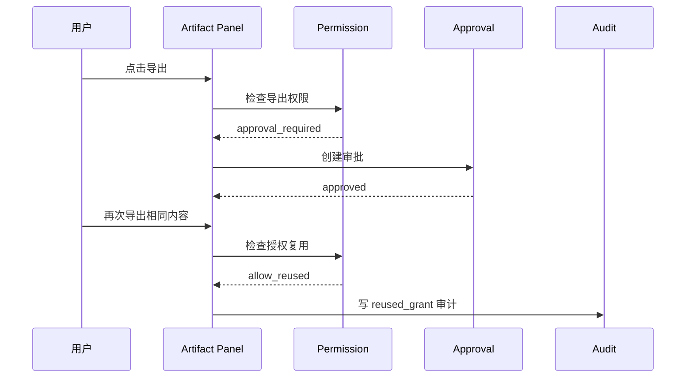

# 企业 Agent 工作台 UI/UX 交互设计

版本：2026-07-01  
适用范围：Phase A-G 开发前交互基线  
视觉与交互参考：Codex、assistant-ui Base、shadcn/ui  
当前前端技术栈：Next.js + assistant-ui + shadcn/ui  

版本化产出物：[`docs/ui-ux/v1/README.md`](./ui-ux/v1/README.md)

## 1. 设计目标

工作台不是传统后台系统，也不是单纯聊天机器人。它的核心交互是：

```text
用户在中间与 Agent 对话
Agent 在执行过程中调用模型、工具、插件、Connector
主对话保留自然语言上下文、执行摘要和结果卡片
右侧业务面板只承载业务 Artifact
设置页面承载模型、插件、审批、账号权限、审计等管理能力
```

设计目标：

- 保持 Codex-style 的对话主体验。
- 优先使用 assistant-ui 官方 Thread、Composer、ThreadList 能力。
- 设置、插件、审批等管理能力放入完整设置页面，不放右侧业务面板。
- 右侧业务面板只做业务内容嵌入，例如查询结果、报表、表格、图表、表单。
- 所有高风险操作具备权限判断、审批、审计反馈。
- 支持明暗主题。
- 支持后续 Web 优先、未来桌面打包和 Windows/macOS 适配。

## 2. 信息架构

### 2.1 顶层结构

```text
App Shell
├── 左侧会话栏
│   ├── 品牌入口
│   ├── 新建任务
│   ├── 最近会话
│   └── 设置与模型
├── 中间 Agent 对话区
│   ├── Thread
│   ├── Message
│   ├── Reasoning / Tool Call
│   ├── Artifact Link Card
│   └── Composer
├── 右侧业务面板
│   ├── Artifact Tabs
│   └── Renderer Host
└── 设置页面
    ├── 概览
    ├── 模型与 Provider
    ├── 插件中心
    ├── 审批中心
    ├── 账号与权限
    ├── 审计记录
    └── 系统诊断
```

### 2.2 设置页面菜单

设置页面采用 Codex-style 完整页面，不使用小弹窗承载复杂配置。

```text
设置与模型
├── 概览
├── 模型
│   ├── 当前模型
│   ├── 可用模型
│   ├── Provider
│   └── 连通性测试
├── 插件
│   ├── 业务类型
│   ├── 筛选条件
│   ├── 插件详情
│   ├── 管理员管理
│   └── 插件审计
├── 审批
│   ├── 我的申请
│   ├── 待我审批
│   ├── 已完成
│   └── 审批详情
├── 账号与权限
│   ├── 个人信息
│   ├── 组织映射
│   ├── 角色权限
│   └── 数据范围
├── 审计
│   ├── 检索
│   ├── 详情
│   └── 导出
└── 诊断
    ├── 服务状态
    ├── 模型状态
    ├── 插件状态
    └── Connector 状态
```

## 3. App Shell 交互

### 3.1 左侧会话栏

左侧会话栏优先沿用 assistant-ui ThreadListSidebar。

默认展开时：

- 顶部显示品牌：“企业 Agent 工作台”。
- 品牌区域点击不跳转；折叠态点击品牌图标展开左侧栏。
- “新建任务”创建新会话。
- 最近会话按时间分组：今天、昨天、更早。
- 底部固定“设置与模型”。

折叠态：

- 只显示品牌图标、新建任务图标、设置图标。
- 品牌图标点击展开。
- hover 显示 tooltip。

状态：

| 状态 | 行为 |
| --- | --- |
| 加载中 | 最近会话显示 skeleton |
| 空列表 | 不显示占位噪音，只保留“新建任务” |
| 会话选中 | 当前项使用浅色背景高亮 |
| 会话删除 | 从列表移除；如果删除当前会话，切到新任务空态 |
| 会话重命名 | inline rename 或更多菜单触发 |

### 3.2 中间 Agent 对话区

对话区以 assistant-ui Thread 为主体，不自建新的聊天框架。

空态：

```text
今天要处理什么？
[Composer]
```

不放大段说明文案，避免占位信息过多。

消息结构：

```text
User Message
Assistant Reasoning / Tool Process
Assistant Answer
Artifact Link Card
Action Bar
```

消息宽度：

- 默认最大宽度约 42rem。
- 右侧业务面板打开时，中间 Thread 保持居中但不能被挤到过窄。
- 滚动条使用系统滚动条或轻量样式，不做突兀进度条。

### 3.3 右侧业务面板

右侧面板只承载业务 Artifact，不承载：

- 设置页
- 插件中心
- 审批中心
- 系统诊断中心

默认关闭。打开后：

- 从右侧滑入，动画与左侧栏折叠/展开一致。
- 支持拖拽调整宽度。
- 默认宽度建议 420px，最大不超过视窗 45%。
- 移动端不默认展示，后续采用全屏 sheet。

Tab 行为：

- 每个 Artifact 一个 Tab。
- Tab hover 右侧显示关闭按钮。
- 关闭 Tab 不删除 Artifact。
- 点击主对话结果卡片可重新打开。
- 多次查询生成多个独立 Tab。

空态：

```text
从对话中的结果卡片打开业务内容
```

不展示 mock 卡片、不展示假数据。

## 4. Composer 交互

Composer 沿用 assistant-ui。

基础能力：

- Enter 发送。
- Option + Enter 换行。
- `+` 添加插件能力。
- 附件按钮用于文件。
- 发送中显示停止按钮。
- 模型选择放在设置页，不放 Composer 内主交互区。

`+` 菜单：

```text
添加插件能力
├── 已授权插件
│   ├── 问数
│   ├── 理赔
│   └── 投保
├── 本地能力
│   ├── 文件读取
│   └── 本地数据分析
└── 申请授权...
```

规则：

- 未授权内部业务插件不在快捷使用区展示。
- 用户可通过“申请授权...”进入插件中心或授权申请。
- 如果用户自然语言触发未授权插件，主对话显示申请授权卡片。

## 5. Agent 执行过程设计

执行过程必须在对应 Assistant 消息内部展示，不能飘到页面顶部。

### 5.1 Reasoning / Tool Process

默认折叠：

```text
执行过程  v
```

运行中：

```text
执行过程  · 正在运行
```

展开后：

```text
执行过程
1. 识别意图：业务数据查询
2. 检查权限：允许
3. 调用工具：ask_data.query
4. 生成结果：Artifact 已创建
```

视觉规则：

- 使用比正文更弱的颜色。
- 字号低于正文。
- 保持 Codex/assistant-ui 风格。
- 运行中显示轻量动态状态，不使用大块 loading 占位。

### 5.2 流式输出

模型输出必须流式展示。

状态顺序：

```text
用户发送
→ run.created
→ intent.classified
→ model.started 或 tool.started
→ model.delta / tool progress
→ artifact.created
→ run.completed
```

UI 表现：

- model.delta 作为打字机输出进入 Assistant Answer。
- runtime event 进入折叠执行过程。
- final_result 只作为兜底，不应覆盖已有流式内容。

### 5.3 失败状态

失败不能假装成功。

常见失败：

| 场景 | 主对话展示 | 可操作 |
| --- | --- | --- |
| 模型未配置 | “模型服务未配置” | 去设置 |
| 权限不足 | “你暂无该数据权限” | 申请权限 |
| 插件未授权 | “需要授权插件” | 申请授权 |
| Connector 失败 | “业务系统调用失败” | 重试 / 查看详情 |
| 审批拒绝 | “审批已拒绝” | 修改范围重新提交 |

## 6. 设置页面 UX

设置页面是完整页面，不是 Dialog。当前 `SettingsDialog` 只是过渡实现，后续应替换为 Codex-style Settings Page。

### 6.1 页面布局

```text
设置页面
├── 左侧设置菜单
│   ├── 概览
│   ├── 模型
│   ├── 插件
│   ├── 审批
│   ├── 账号与权限
│   ├── 审计
│   └── 诊断
└── 右侧内容区
    ├── 标题
    ├── 描述
    ├── 筛选/操作区
    └── 内容卡片/表格/详情
```

进入方式：

- 左侧底部“设置与模型”。
- 主对话卡片可 deep link 到具体设置子页面，例如审批详情、插件授权、模型配置。

退出方式：

- 返回 Agent 工作台。
- 浏览器后退保留上一个设置页状态。

## 7. Phase C：模型设置 UX

### 7.1 角色视图

普通用户：

- 可查看授权范围内 Provider。
- 可选择当前模型。
- 可查看 Provider 名称、base_url、可用模型。
- 不可新增、编辑、删除 Provider。
- 不可查看 API Key 明文。

租户管理员 / 系统管理员：

- 可新增 Provider。
- 可编辑 base_url、模型列表、默认模型。
- 可更新 API Key。
- 有权限时可查看 API Key 明文。
- 查看明文必须二次确认并写审计。

### 7.2 Provider 卡片

卡片字段：

```text
Provider 名称
Provider 类型：OpenAI-compatible
Base URL
默认模型
配置状态
Key：****abcd  [显示]
操作：测试连接 / 刷新模型 / 编辑 / 停用
```

API Key 明文切换：

```text
点击“显示”
→ 权限检查
→ 二次确认：“查看密钥明文会被审计”
→ 展示短时明文
→ 30 秒后自动恢复脱敏
→ 写审计
```

### 7.3 模型列表

支持：

- 手动添加模型 ID。
- 远程刷新 `/models`。
- 设置默认模型。
- 按权限显示可用模型。

空状态：

```text
还没有可用模型。请联系管理员配置 Provider。
```

## 8. Phase D：插件中心 UX

### 8.1 页面入口

插件中心位于设置页面菜单“插件”。

不是右侧面板，不是 Composer 弹窗。

### 8.2 插件组织方式

主分类按业务类型：

```text
全部业务
问数
理赔
投保
查询
办公
本地文件
外部通用
```

筛选条件：

```text
全部插件
已授权
待授权
可升级
已停用
管理员管理
审计记录
```

### 8.3 插件卡片

卡片字段：

```text
插件名称
业务类型
能力摘要
风险等级
授权状态
启用状态
Connector 状态
操作按钮
```

普通用户按钮：

| 状态 | 按钮 |
| --- | --- |
| 未授权 | 申请授权 |
| 已授权未启用 | 启用 |
| 已启用 | 停用 / 使用 |
| 不可用 | 查看原因 |

管理员按钮：

```text
租户启用
停用
升级
配置权限
查看审计
```

### 8.4 插件详情

详情区包含：

- 插件说明
- 能力列表
- 触发示例
- 风险等级
- 权限范围
- Connector 绑定状态
- 版本记录
- 审计记录

## 9. Phase F：审批中心 UX

### 9.1 入口

审批中心位于设置页面菜单“审批”。

主对话只展示审批摘要卡片，不在右侧业务面板展示审批详情。

### 9.2 审批列表

Tabs：

```text
我的申请
待我审批
已完成
全部
```

筛选：

```text
审批类型
状态
申请人
时间范围
资源类型
风险等级
```

### 9.3 审批摘要卡片

在主对话中：

```text
需要审批：查询全国惠民保保费
类型：数据权限申请
范围：2026 / 全国 / 总保费
状态：待审批
审批编号：approval_xxx
[查看详情]
```

点击“查看详情”进入设置页审批详情。

### 9.4 审批详情

详情字段：

```text
审批编号
申请人
申请时间
审批类型
资源类型
申请范围
申请原因
风险等级
关联 Run
关联 Artifact
审计编号
流转记录
```

操作：

```text
通过
拒绝
重新提交
继续执行
```

规则：

- 审批通过后不自动继续执行。
- 用户必须点击“继续执行”。
- 拒绝后允许修改范围重新提交。
- 审批过期后不可通过，只能重新提交。

## 10. Phase G：业务 Artifact UX

### 10.1 主对话结果卡片

业务结果不直接把大表格塞进对话。对话显示摘要卡片：

```text
2026 年惠民保项目总保费
12.36 亿元
审计编号：evt_xxx
[打开结果]
```

点击打开右侧 Artifact。

### 10.2 右侧 Artifact 面板

Tab 标题：

```text
惠民保总保费
理赔查询
投保核验
```

Tab 内容：

```text
Artifact Title
Meta：Run / 审计编号 / 数据时间 / 权限范围
Renderer Content
Actions：复制 / 导出 / 下载 / 查看审计
```

### 10.3 Renderer 白名单

第一批：

```text
Metric
Table
Chart
Form
QueryPlan
AuditInfo
ErrorState
JSONFallback
```

不允许：

- AI 生成 React/JS 并执行。
- AI 生成任意 HTML script。
- 未注册 renderer 自动执行。

### 10.4 权限与审批复用

复制 / 下载 / 导出都需要权限判断。

首次操作：

```text
点击导出
→ 权限判断
→ 允许：执行并写审计
→ 不足：创建审批
```

复用条件：

```text
同一用户
同一 Artifact 内容 hash
同一权限范围 hash
同一操作类型
审批仍有效
```

满足则：

```text
不重复审批
但写 reuse audit event
```

## 11. 典型场景流程

### 11.1 通用 Agent 对话



### 11.2 业务查询权限允许



### 11.3 业务查询权限不足



### 11.4 插件授权



### 11.5 Artifact 导出复用审批



## 12. 状态设计

### 12.1 全局状态

| 状态 | UI |
| --- | --- |
| 后端不可用 | Composer 上方轻提示，发送失败不清空输入 |
| 模型未配置 | 主对话错误卡 + 去设置 |
| 插件未授权 | 申请授权卡 |
| 权限不足 | 申请权限卡 |
| 审批中 | 审批摘要卡 |
| 审批通过待继续 | 继续执行卡 |
| Connector 失败 | 错误卡 + 重试 |

### 12.2 右侧面板状态

| 状态 | UI |
| --- | --- |
| 关闭 | 不占宽度，仅显示展开按钮 |
| 空 | “从对话中的结果卡片打开业务内容” |
| 加载 | Tab 内 skeleton |
| 成功 | 对应 renderer |
| 无权限 | 申请权限入口 |
| 渲染器缺失 | JSON fallback |
| 错误 | ErrorState + 重试 |

### 12.3 设置页状态

| 状态 | UI |
| --- | --- |
| 无权限 | 展示只读或无权限说明 |
| 加载中 | 内容区 skeleton |
| 保存中 | 按钮 loading |
| 保存成功 | toast / inline success |
| 保存失败 | inline error，保留输入 |
| 敏感操作 | 二次确认 |

## 13. 权限与审计提示设计

原则：

- 用户只看必要风险信息，不暴露内部策略细节。
- 明确告诉用户“为什么不能继续”和“下一步怎么做”。
- 审计编号可复制。

文案示例：

| 场景 | 文案 |
| --- | --- |
| 无数据权限 | 你暂无该数据范围的访问权限。可以提交权限申请。 |
| 查看密钥明文 | 查看密钥明文会记录审计日志，仅限授权管理员操作。 |
| 导出需审批 | 该结果包含受控数据，导出前需要审批。 |
| 审批复用 | 已复用相同内容的有效审批，操作已记录审计。 |
| 插件未授权 | 使用该插件前需要完成授权。 |

## 14. 响应式与平台适配

Web 第一版：

- 桌面宽屏为主。
- 左侧栏可折叠。
- 右侧业务面板可折叠和拖拽。

窄屏：

- 左侧栏变为 overlay sheet。
- 右侧业务面板未来变为全屏 sheet。
- 设置页保持完整页面。

未来桌面：

- macOS / Windows 使用同一 Web Shell。
- 保持系统级滚动、快捷键、窗口尺寸适配。

## 15. 开发优先级

UI/UX 开发顺序建议：

```text
1. 保持 assistant-ui Thread 稳定
2. 设置页框架替换 SettingsDialog
3. 模型设置页
4. 插件中心页面
5. 审批中心页面
6. Artifact Link Card
7. 右侧 Artifact Panel Renderer
8. 权限/审计状态细节
```

## 16. 开发验收清单

进入开发前，开发任务必须能映射到以下交互：

- [ ] 新建任务可创建空会话。
- [ ] 点击历史会话可加载对应 Thread。
- [ ] Agent 执行过程显示在对应消息内部。
- [ ] 模型输出支持流式显示。
- [ ] 设置页是完整页面，不是小弹窗。
- [ ] 模型 Provider 支持脱敏/明文切换和审计。
- [ ] 插件中心位于设置页，按业务类型组织。
- [ ] 普通用户插件操作为申请授权/启用/停用/使用。
- [ ] 审批中心位于设置页。
- [ ] 审批通过后需要手动继续执行。
- [ ] 主对话业务结果卡片可打开右侧 Artifact。
- [ ] 右侧 Artifact 多 Tab 可关闭和重开。
- [ ] 未注册 renderer 安全 fallback。
- [ ] 下载/导出/复制走权限和审计。
- [ ] 相同内容审核可复用，但复用也写审计。
