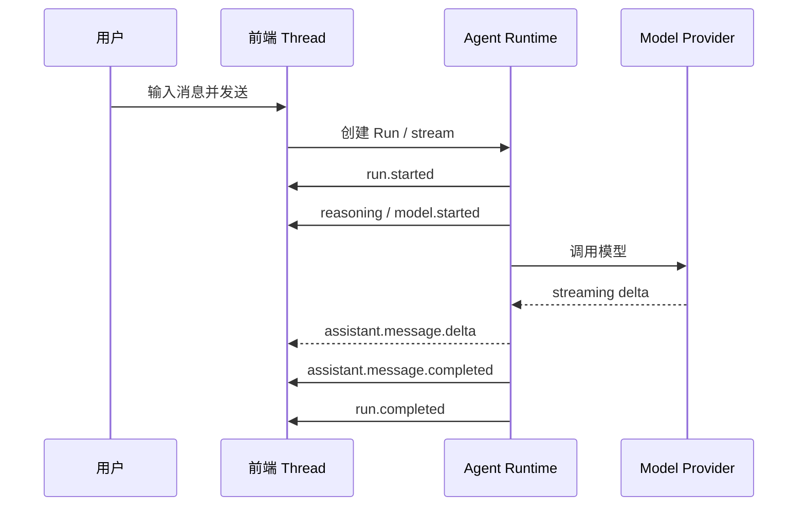
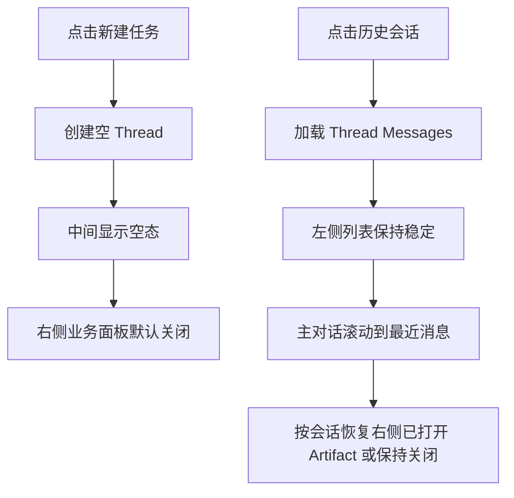
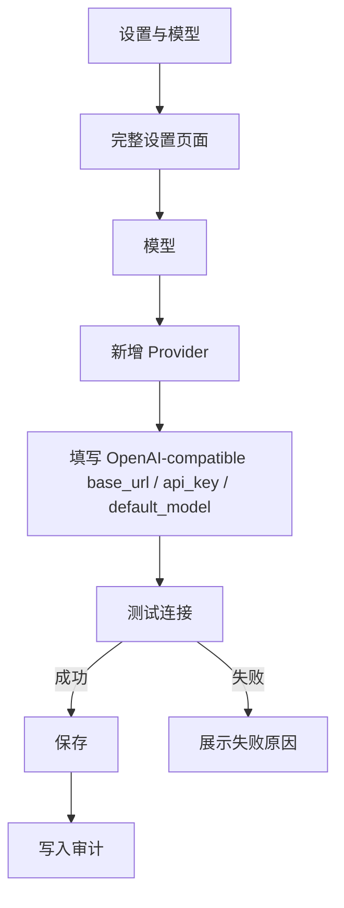
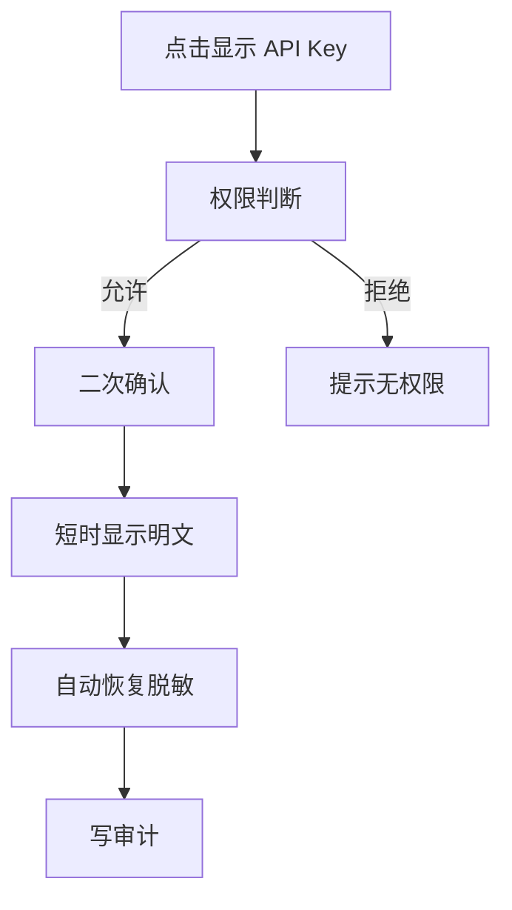
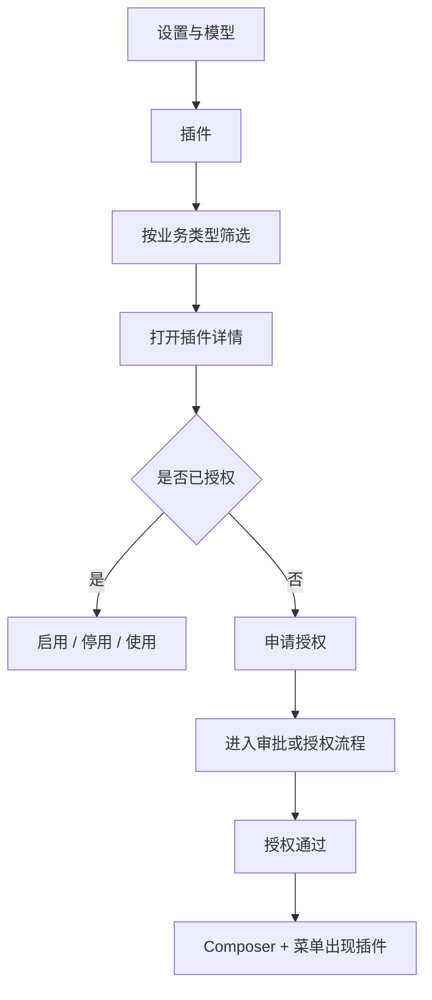
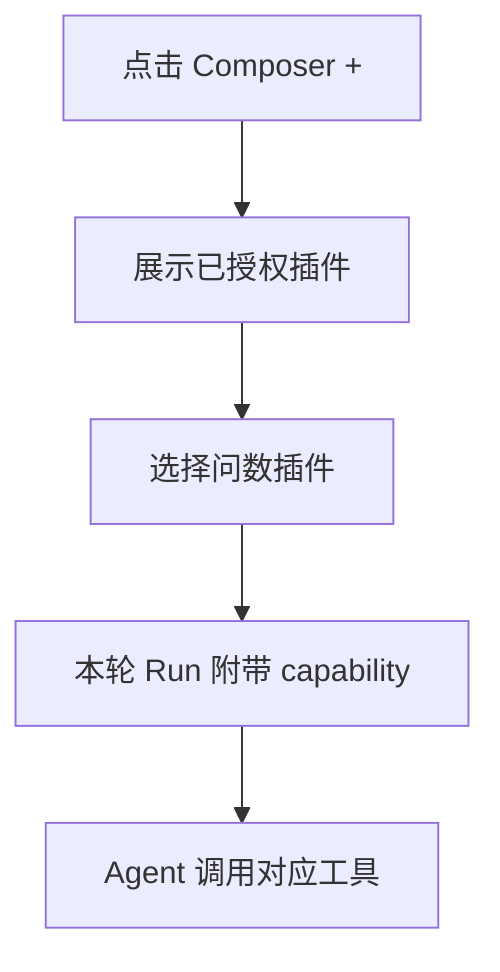
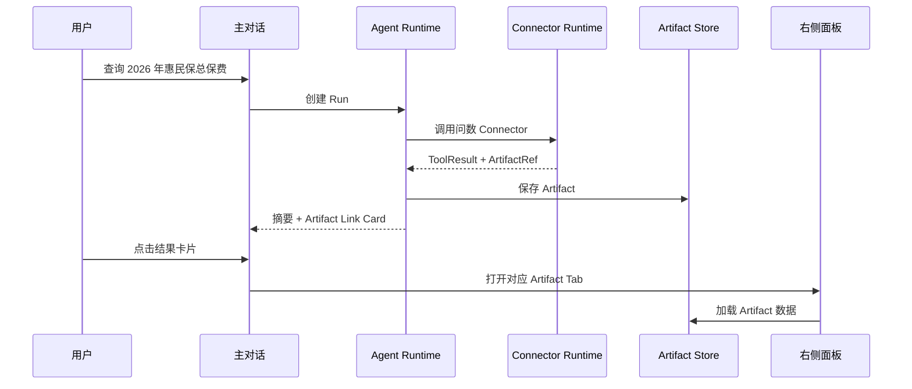
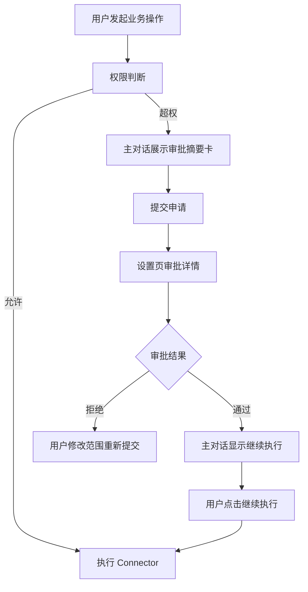
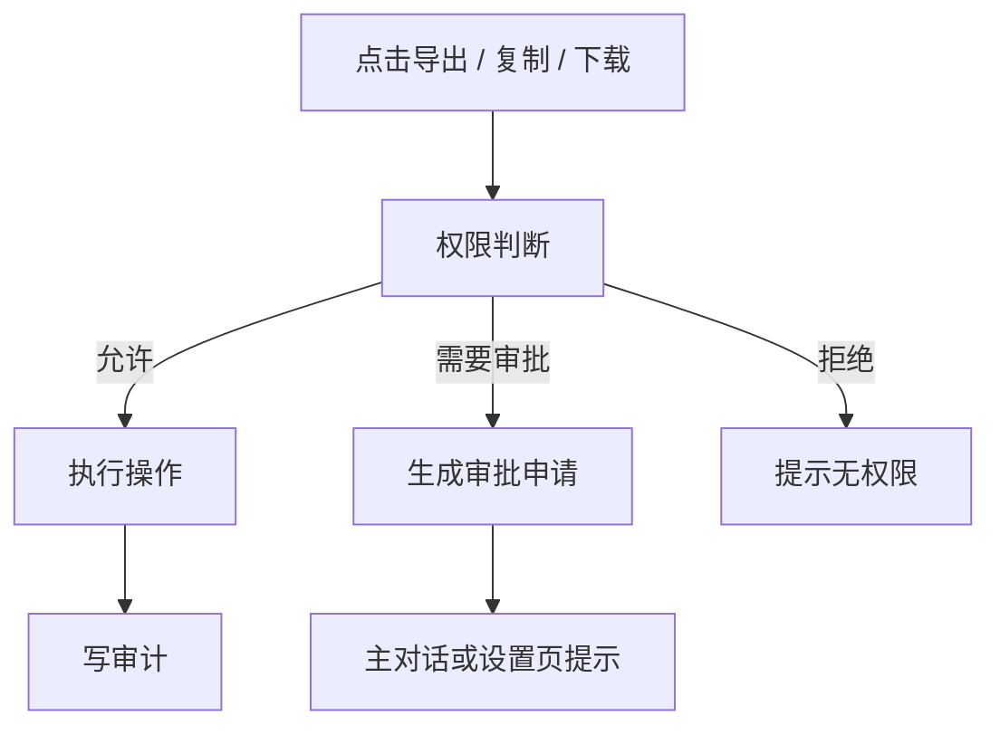
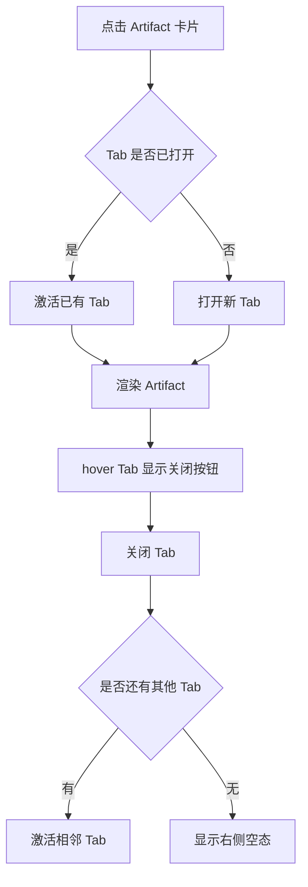

# 核心交互流程

版本：v1  
日期：2026-07-01

## 1. 通用 Agent 对话

UI 要求：

- 用户消息立即显示。
- 执行过程显示在本轮 assistant 消息上方，默认折叠。
- 模型输出流式显示。
- 完成后 action bar 可复制、重试。
- 失败时显示明确错误，不展示成功文案。

## 2. 新建任务和历史会话

约束：

- 点击历史会话不能导致左侧列表消失或 skeleton 长时间残留。
- 会话列表刷新和消息加载分离。
- 当前 Thread 的右侧打开 Tab 可按会话维度保存。

## 3. 模型 Provider 配置

明文查看流程：

UI 要求：

- API Key 默认脱敏。
- 明文展示不进入本地持久化。
- 查看明文必须产生审计。

## 4. 插件授权和使用

Composer 使用流程：

约束：

- 普通用户不看到“安装”概念。
- 未授权内部业务插件不在 Composer 快捷菜单出现。
- 自然语言触发未授权能力时，在主对话展示申请授权卡。

## 5. 业务查询和 Artifact

UI 要求：

- 主对话显示摘要和结果卡片。
- 右侧打开结构化结果。
- 第二次调整条件会生成新的结果卡片和新的 Artifact。
- 多个 Artifact 可在右侧多 Tab 切换。

## 6. 权限不足和审批

约束：

- 自建审批优先。
- 审批通过不自动继续。
- 同一用户、同一内容、同一权限范围、同一动作已审核通过时，可复用审批，但复用必须写审计。

## 7. Artifact 导出 / 复制 / 下载

规则：

- 所有导出、复制、下载都必须记录。
- 可配置哪些动作需要审批。
- 审计记录包含：用户、会话、Run、Artifact、动作、权限判断、审批复用情况。

## 8. 右侧面板 Tab 管理

约束：

- 关闭 Tab 不删除 Artifact。
- 会话切换时，右侧 Tab 状态跟会话区分。
- 如果当前会话无打开 Artifact，右侧默认关闭或显示空态。

