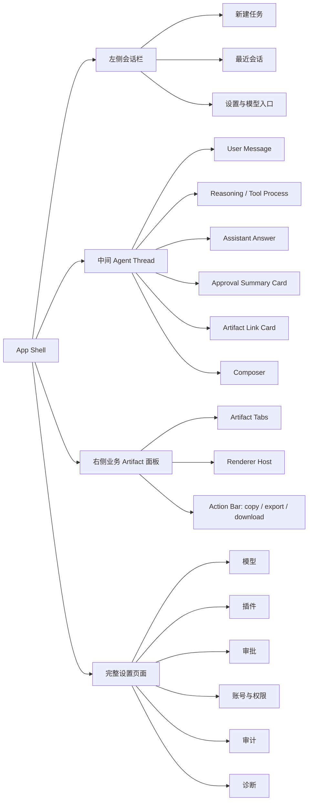
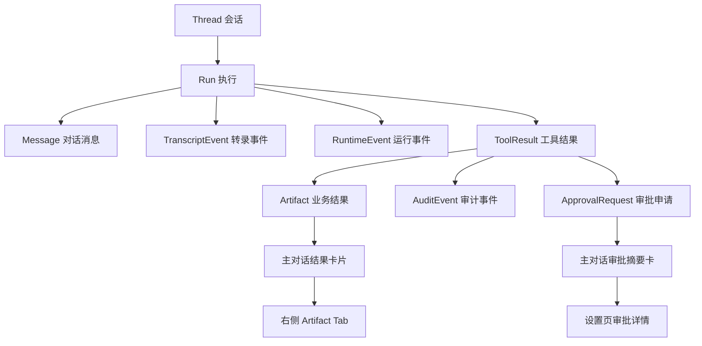

# 目标体验地图

版本：v1  
日期：2026-07-01

## 1. 产品定位

企业 Agent 工作台的主体验不是“后台管理系统”，也不是“普通聊天机器人”。它是：

```text
以 Agent 对话为中心
以插件和 Connector 调用企业系统
以权限、审批、审计满足金融企业治理要求
以右侧业务 Artifact 面板承载结构化结果
```

因此页面职责必须稳定：

| 区域 | 职责 | 不承担 |
| --- | --- | --- |
| 左侧 | 会话导航、新建任务、设置入口 | 业务详情、插件市场、复杂工作空间管理 |
| 中间 | Agent 对话、执行过程、结果摘要、卡片入口 | 大表格、大报表、复杂表单 |
| 右侧 | 业务 Artifact 渲染和多 Tab 查看 | 设置页、插件中心、审批中心、系统诊断 |
| 设置页 | 模型、插件、审批、权限、审计、诊断 | 具体业务结果查看 |

## 2. 顶层信息架构



## 3. 用户角色体验

### 3.1 普通员工

核心任务：

- 与 Agent 对话。
- 使用已授权插件。
- 查看业务结果。
- 申请插件或数据权限。
- 查看自己的申请和执行结果。

主路径：

```text
打开工作台
→ 新建任务或选择历史会话
→ 输入任务
→ Agent 执行
→ 主对话看到摘要或结果卡片
→ 点击结果卡片打开右侧业务面板
→ 如遇权限不足，提交申请
```

### 3.2 团队管理员 / 租户管理员

核心任务：

- 配置模型 Provider。
- 管理插件启用范围。
- 查看权限和审计。
- 审批或协助审批。

主路径：

```text
打开设置与模型
→ 进入模型 / 插件 / 审批 / 审计页面
→ 配置或处理管理事项
→ 所有敏感动作写入审计
```

### 3.3 审计管理员

核心任务：

- 检索审计记录。
- 查看运行链路。
- 导出审计证据。
- 查看敏感字段明文时触发审计。

主路径：

```text
打开设置与模型
→ 审计
→ 按用户 / 会话 / Run / 插件 / 时间筛选
→ 查看审计详情
→ 导出审计结果
```

## 4. 核心对象和页面关系



设计含义：

- Thread 是左侧会话列表的核心对象。
- Run 是一次用户输入后的执行实例。
- Message 服务主对话展示。
- TranscriptEvent 服务未来回放、迁移和更细粒度调试。
- RuntimeEvent 服务执行过程展示。
- ToolResult 是工具调用回写和 Artifact 生成的中间结构。
- Artifact 是右侧业务面板的唯一核心内容。

## 5. 页面跳转原则

| 触发 | 目标 |
| --- | --- |
| 点击会话 | 主对话加载该 Thread，右侧面板保持或按会话恢复打开 Artifact |
| 新建任务 | 新 Thread 空态，右侧面板默认关闭 |
| 点击结果卡片 | 打开右侧面板并激活对应 Artifact Tab |
| 点击审批详情 | 进入设置页审批详情 |
| 点击模型设置 | 进入设置页模型 |
| 点击插件授权 | 进入设置页插件详情或授权申请 |
| 点击审计编号 | 进入设置页审计详情 |

## 6. 右侧面板使用原则

使用右侧面板的场景：

- 查询结果表格。
- 图表、指标卡。
- 报表预览。
- 业务系统嵌入视图。
- 可操作但受控的业务表单。
- Agent 生成的受控 Artifact UI。

不使用右侧面板的场景：

- 模型配置。
- 插件中心。
- 审批中心。
- 系统诊断。
- 账号权限管理。
- 审计检索。
- 通用帮助说明。

## 7. 主对话使用原则

主对话承载：

- 用户自然语言输入。
- Agent 自然语言回复。
- 执行过程摘要。
- 工具调用状态。
- 权限不足提示。
- 审批摘要卡片。
- 业务结果链接卡片。

主对话不承载：

- 大型表格。
- 多页报表。
- 复杂审批详情。
- API Key 明文。
- 复杂插件配置表单。

